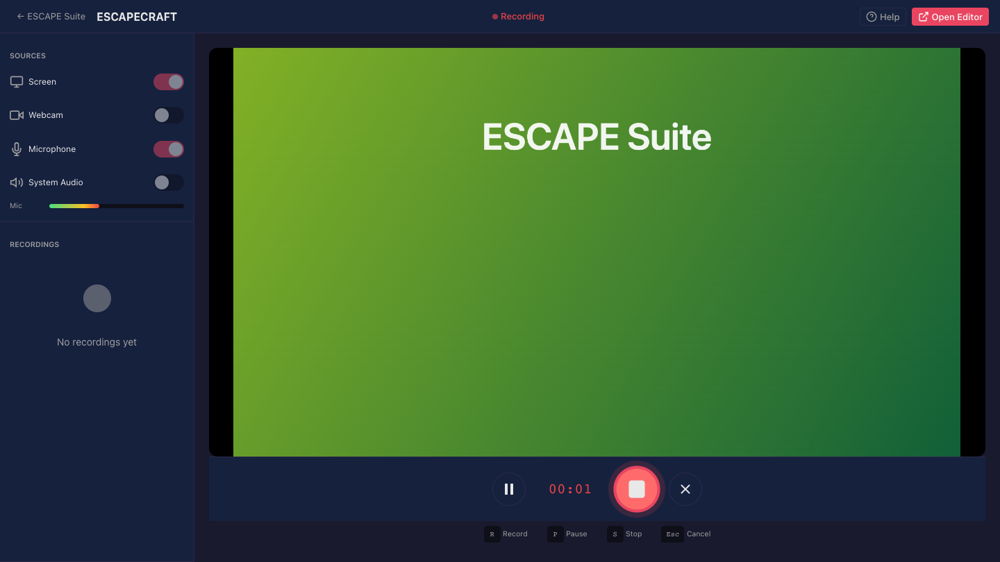
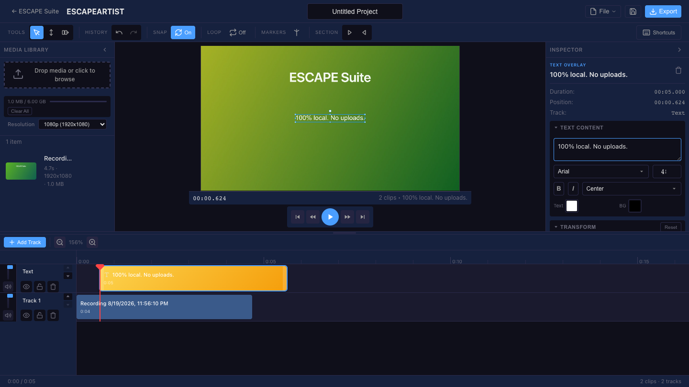

# ESCAPE Suite

[](https://github.com/Bonham-Technologies/ESCAPESUITE/actions/workflows/ci.yml)
[](LICENSE)
[](https://github.com/Bonham-Technologies/ESCAPESUITE/releases/latest)

Free, open-source (MIT), privacy-first media creation tools that run entirely in the browser. Nothing you record or edit ever leaves your machine.


*Record in ESCAPECRAFT, hand it to ESCAPEARTIST in one click, add a text overlay, export — every frame processed locally.*

## Use it now

Hosted free at [escapesuite.io](https://escapesuite.io) — no account, no sign-up.

| App | Description | Try it |
|-----|-------------|--------|
| **ESCAPEPLAN** | Landing page & hub | [escapesuite.io](https://escapesuite.io) |
| **ESCAPECRAFT** | Screen & webcam recorder | [escapesuite.io/craft](https://escapesuite.io/craft) |
| **ESCAPEARTIST** | Video editor with timeline & effects | [escapesuite.io/artist](https://escapesuite.io/artist) |

Or download the offline build from [Releases](https://github.com/Bonham-Technologies/ESCAPESUITE/releases/latest) — a single HTML file that runs air-gapped, no internet required.

## Features

### ESCAPECRAFT - Recorder



- Screen, window, or tab capture
- Webcam recording with Picture-in-Picture overlay
- Microphone and system audio capture
- Adjustable PiP position, size, and shape (circle/square)
- Send recordings directly to ESCAPEARTIST

### ESCAPEARTIST - Editor



- Multi-track timeline with drag-and-drop
- Text and shape overlays with animations
- Keyframe animation system with 10 easing curves
- 11 transition types between clips
- Blur effect for privacy/focus
- Export to WebM (VP9) or MP4 (H.264)

### ESCAPEPLAN - Landing page & hub
- Landing page with links to ESCAPECRAFT and ESCAPEARTIST
- Privacy and terms pages
- No accounts, no sign-in, no tracking of personal data

## Quick start (development)

```bash
# Clone the repository
git clone https://github.com/Bonham-Technologies/ESCAPESUITE.git
cd ESCAPESUITE

# Install dependencies
pnpm install

# Start all apps in development
pnpm dev
```

| App | Dev URL |
|-----|---------|
| ESCAPEPLAN | http://localhost:5173 |
| ESCAPECRAFT | http://localhost:5174 |
| ESCAPEARTIST | http://localhost:5175 |

Or start individual apps: `pnpm dev:plan`, `pnpm dev:craft`, `pnpm dev:artist`.

```bash
# Production builds
pnpm build               # Build all apps (Turbo cached)
pnpm build:standalone    # Offline single-file builds (ESCAPECRAFT + ESCAPEARTIST)
```

No environment variables are required to build or run anything in this repo.

## Self-hosting

```bash
pnpm build:deploy        # Combined build for deployment, outputs to /dist
```

`pnpm build:deploy` produces a static `dist/` directory (ESCAPEPLAN at the root, ESCAPECRAFT at `/craft/`, ESCAPEARTIST at `/artist/`) that you can deploy to any static host — Vercel, Netlify, GitHub Pages, S3, or a plain web server.

The offline build (`pnpm build:standalone`) needs no host at all — it's a single self-contained HTML file per app that you can open directly from disk (`file://`) or hand to someone else.

## Browser support

Recording works in all modern browsers (Chrome, Edge, Firefox, Safari). Exporting video (WebM/MP4) requires the WebCodecs API, which is currently only available in **Chrome and Edge**.

## Testing

```bash
pnpm test                # Unit tests for all apps
pnpm test:e2e             # Playwright E2E tests (Chromium)
```

## Contributing

Contributions are welcome. See [CONTRIBUTING.md](CONTRIBUTING.md) for setup and PR guidelines.

## License

MIT — see [LICENSE](LICENSE) for details.

---

**ESCAPE Suite** - Professional media creation in your browser.
